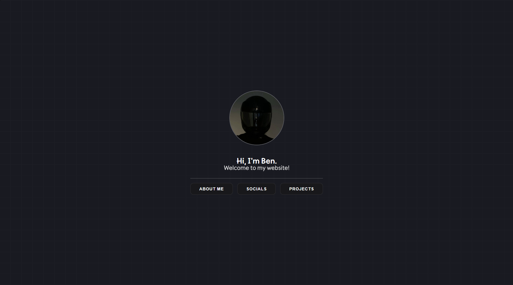
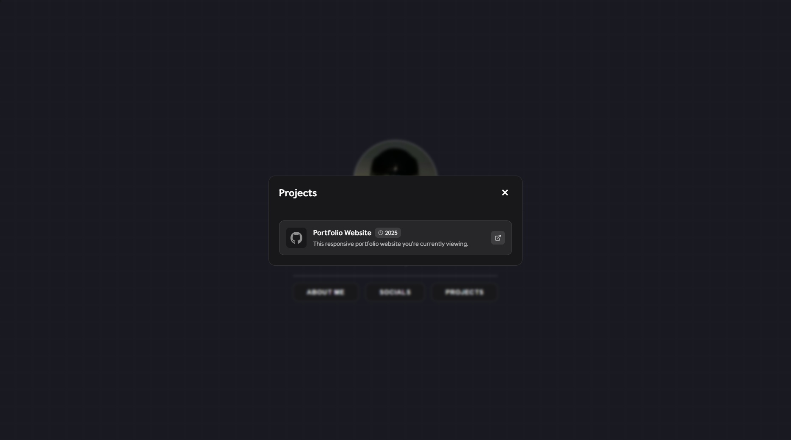

# 🚀 Modern Portfolio Template

A beautiful, responsive portfolio website built with React, TypeScript, and Vite. Fully customizable through a simple YAML configuration file.


## ✨ Features

- 🎨 **Modern Design** - Clean, professional interface with smooth animations
- 📱 **Fully Responsive** - Works perfectly on desktop, tablet, and mobile
- ⚙️ **Easy Configuration** - Customize everything through `config/config.yml`
- 🌐 **Google Fonts Support** - Use any Google Font for typography
- 🔗 **Social Media Integration** - Add up to 5 social media buttons with custom icons
- 📂 **Project Showcase** - Display up to 5 projects with descriptions and links
- 🎭 **Modal System** - Smooth modal animations for About, Socials, and Projects
- 🖼️ **Custom Icons** - Support for emojis, text, or image URLs as icons
- 🔍 **SEO Ready** - Dynamic page titles and favicon support

## 📸 Screenshots

### Main Page


### About Modal


### Socials Modal


### Projects Modal


## 🚀 Quick Start

### Installation

1. **Clone the repository**
   ```bash
   git clone https://github.com/yourusername/portfolio-template.git
   cd portfolio-template
   ```

2. **Install dependencies**
   ```bash
   npm install
   ```

3. **Start development server**
   ```bash
   npm run dev
   ```

4. **Build for production**
   ```bash
   npm run build
   ```

5. **Preview production build**
   ```bash
   npm run preview
   ```

## ⚙️ Configuration

All customization is done through the `config/config.yml` file. Here's what you can configure:

### Basic Settings

```yaml
# Your name (appears in "Hi, I'm [NAME]")
NAME: "Your Name"

# Icon format for your profile picture
ICON_FORMAT: "PNG"  # Options: PNG, JPG, GIF

# Google Font (optional)
GOOGLE_FONT: "Inter"  # Any Google Font name
```

### Profile Picture

Place your profile picture in the `config/` folder as:
- `usericon.png` (if ICON_FORMAT is "PNG")
- `usericon.jpg` (if ICON_FORMAT is "JPG") 
- `usericon.gif` (if ICON_FORMAT is "GIF")

### About Me Section

```yaml
ABOUT_ME_CONTENT: |
  Write your bio here.
  You can use multiple lines.
  
ABOUT_ME_ALIGN: "left"  # Options: left, center, right
```

### Social Media Buttons

```yaml
SOCIALS_CONTENT: "Connect with me on these platforms:"
SOCIALS_ALIGN: "center"

SOCIAL_BUTTONS:
  - name: "GitHub"
    url: "https://github.com/yourusername"
    icon: "🐙"  # Emoji or image URL
  - name: "Twitter"
    url: "https://twitter.com/yourusername"
    icon: "https://example.com/twitter-icon.png"
```

### Projects Section

```yaml
PROJECTS:
  - icon: "🚀"  # Emoji or image URL
    title: "Project Name"
    description: "Brief description of your project"
    period: "2024-now"
    url: "https://github.com/yourusername/project"
```

## 🎨 Customizing Icons

### For Social Media & Projects

You can use three types of icons:

1. **Emojis**: `icon: "🚀"`
2. **Text**: `icon: "JS"`
3. **Image URLs**: `icon: "https://example.com/icon.png"`

### For Favicons

1. Create your favicon using [Favicon.io Converter](https://favicon.io/favicon-converter/)
2. Download the generated files
3. Replace all files in the `public/` folder:
   - `favicon.ico`
   - `favicon-16x16.png`
   - `favicon-32x32.png`
   - `favicon-48x48.png`
   - `apple-touch-icon.png`
   - `android-chrome-192x192.png`
   - `android-chrome-512x512.png`

## 📁 Project Structure

```
portfolio-template/
├── config/
│   ├── config.yml          # Main configuration file
│   └── usericon.png        # Your profile picture
├── public/
│   ├── favicon.ico         # Favicon files
│   ├── favicon-*.png       # Various favicon sizes
│   └── site.webmanifest    # PWA manifest
├── src/
│   ├── App.tsx             # Main React component
│   ├── main.tsx            # Entry point
│   └── index.css           # Styles
├── you-can-delete-that/    # Screenshots (can be deleted)
└── README.md
```

## 🎯 Limits

- **Social Media Buttons**: Maximum 5 buttons
- **Projects**: Maximum 5 projects
- **Profile Picture**: Recommended size 200x200px or larger

## 🛠️ Built With

- [React](https://reactjs.org/) - UI Framework
- [TypeScript](https://www.typescriptlang.org/) - Type Safety
- [Vite](https://vitejs.dev/) - Build Tool
- [js-yaml](https://github.com/nodeca/js-yaml) - YAML Parser

## 📝 License

This project is open source and available under the [MIT License](LICENSE).

## 🤝 Contributing

Contributions, issues, and feature requests are welcome! Feel free to check the [issues page](https://github.com/yourusername/portfolio-template/issues).

## ⭐ Show Your Support

If this template helped you, please give it a ⭐ on GitHub!

---

**Made with ❤️ by [Your Name](https://github.com/yourusername)**